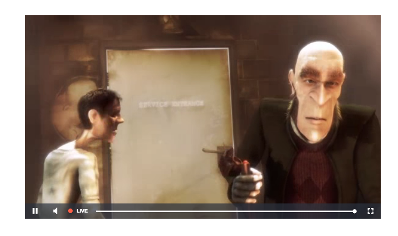

[npm-icon]: https://nodei.co/npm/videojs-dvr.png?downloads=true&downloadRank=true&stars=true

[npm-link]: https://nodei.co/npm/videojs-dvr/

# videojs-dvr

A Video.js plugin for Seekbar with DVR support.

[![NPM][npm-icon]][npm-link]



## Table of Contents

<!-- START doctoc -->
<!-- END doctoc -->
## Installation

```sh
npm install --save videojs-dvr
```

## Usage

To include videojs-dvr on your website or web application, use any of the following methods.

### `<script>` Tag

This is the simplest case. Get the script in whatever way you prefer and include the plugin _after_ you include [video.js][videojs], so that the `videojs` global is available.

```html
<script src="//path/to/video.min.js"></script>
<script src="//path/to/videojs-dvr.min.js"></script>
<script>
  var player = videojs('my-video');

  player.dvr();
</script>
```

### Browserify/CommonJS

When using with Browserify, install videojs-dvr via npm and `require` the plugin as you would any other module.

```js
var videojs = require('video.js');

// The actual plugin function is exported by this module, but it is also
// attached to the `Player.prototype`; so, there is no need to assign it
// to a variable.
require('videojs-dvr');

var player = videojs('my-video');

player.dvr();
```

### RequireJS/AMD

When using with RequireJS (or another AMD library), get the script in whatever way you prefer and `require` the plugin as you normally would:

```js
require(['video.js', 'videojs-dvr'], function(videojs) {
  var player = videojs('my-video');

  player.dvr();
});
```

## License

MIT. Copyright (c) ffernandez &lt;ff.fernandez.facundo@gmail.com&gt;


[videojs]: http://videojs.com/
